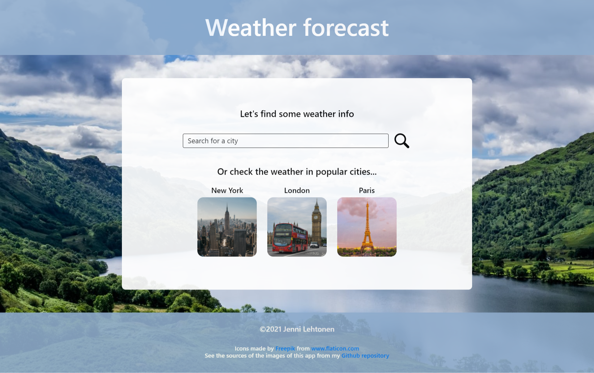

# Weather-app
With this application you can search for weather forecasts. The data of the application is fetched from OpenWeatherMap.

[You can watch a video of the weather app here](https://jennilehtonen.github.io/Weather-app/video.html)

|Table of contents|
|:------------- |
|1. [Technical solutions of the application](#Technical-solutions-of-the-application)|
|2. [Pictures of the user interface](#Pictures-of-the-user-interface)|

## Technical solutions of the application
Used technologies: **HTML, CSS, JavaScript and ReactJS**.

### Styling
The UI is created with **React Bootstrap** elements and with basic **HTML** elements with **CSS** styling.

#### Image and icon attribution
The icons of the app are from **Bootstrap Icons** and **Flaticon**.
The images of the app are from **Pexels** (New York photo by [Louis](https://www.pexels.com/@louis-965146), London photo by [Joanna Zduńczyk](https://www.pexels.com/@joanna-zdunczyk-18647846), Paris photo by [Eugene Dorosh](https://www.pexels.com/@eugene-dorosh-230277) and **Unsplash** (background photo by [Gary Ellis](https://unsplash.com/@garyellisphoto))

## Pictures of the user interface

This is the view when the user opens the application.

This is the view when the user sees the weather for the searched city

